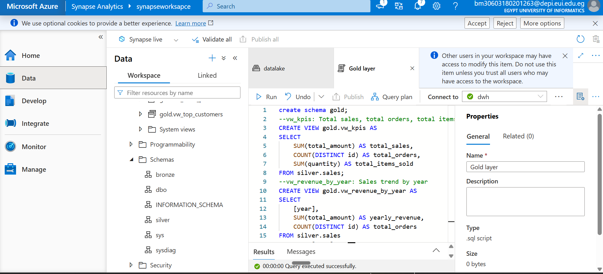
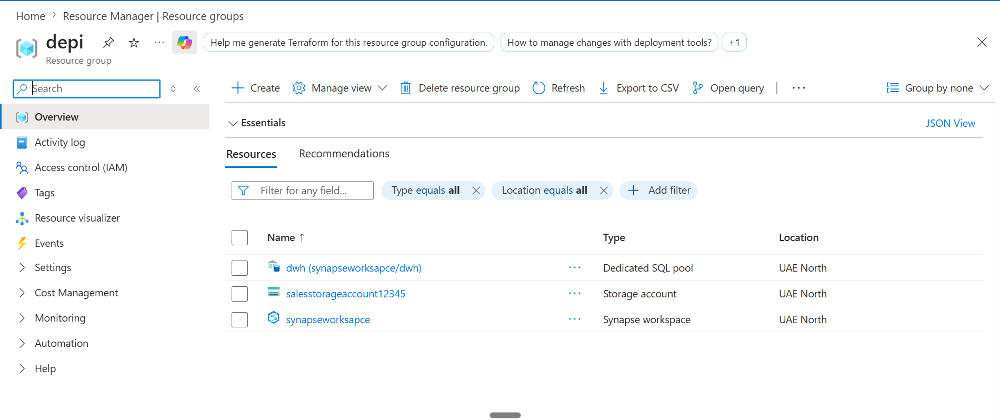
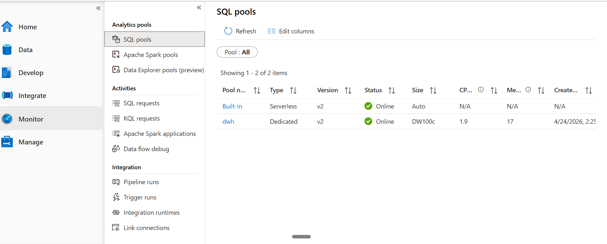
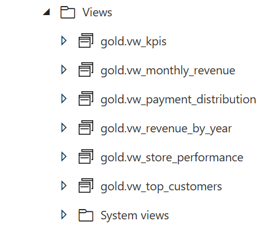
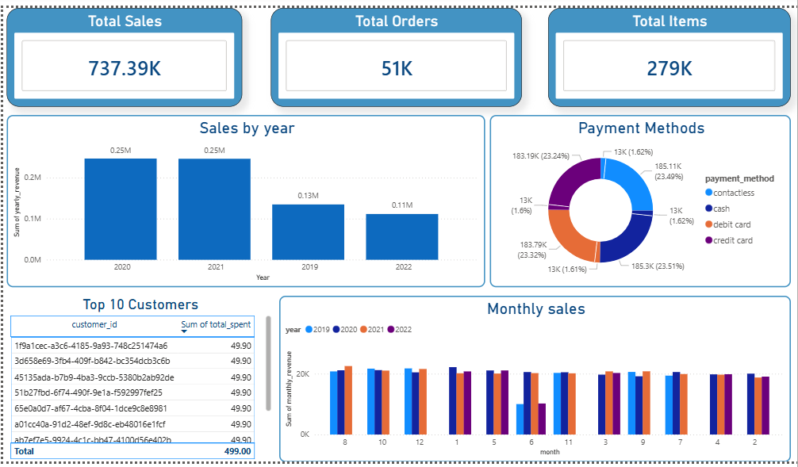
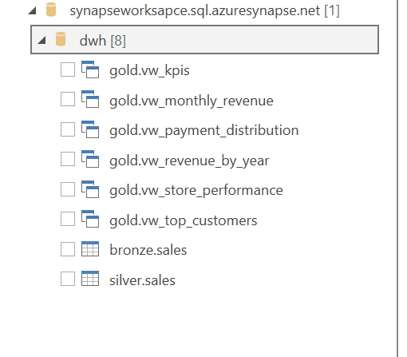

# Sales Data Pipeline using Azure Synapse + Power BI

## 📊 Project Overview

This project demonstrates a comprehensive data analytics solution leveraging Azure cloud services and Power BI for sales data visualization and analysis. The solution implements a modern data lakehouse architecture using Azure Synapse Analytics with a medallion pattern (Bronze, Silver, Gold layers).

## 🎯 Objectives

- Create a scalable data pipeline for sales data ingestion and transformation
- Implement dimensional modeling using the medallion architecture pattern
- Build interactive Power BI dashboards for business intelligence
- Enable real-time analytics and reporting capabilities
- Demonstrate cloud-native data engineering best practices

## 🏗️ Architecture Overview

### Data Pipeline Layers

- **Bronze Layer**: Raw data ingestion layer - stores unprocessed data from source systems
- **Silver Layer**: Cleaned and standardized data layer - applies data quality rules and transformations
- **Gold Layer**: Business-ready analytics layer - optimized for reporting and BI tools

### Technology Stack

| Component | Technology |
|-----------|-----------|
| Cloud Platform | Microsoft Azure |
| Data Warehouse | Azure Synapse Analytics |
| ETL/ELT | SQL Scripts |
| BI & Analytics | Power BI |
| Data Storage | Azure Data Lake |

## 📁 Project Structure

```
Sales_Azure_PowerBI/
├── SQL_scipts/
│   ├── Bronze_layer.sql      # Raw data layer schema and ingestion
│   ├── Silver_layer.sql      # Data cleansing and transformation logic
│   └── Gold_layer.sql        # Analytics-ready aggregated tables
├── DataSource/
│   └── DataSource.txt        # Data source configurations
├── PowerBI_Dashboard/
│   └── Sales_Report/         # Power BI report files and visualizations
├── Screenshots/              # Implementation and dashboard screenshots
└── README.md                 # This file
```

## 🚀 Implementation Details

### 1. Azure Synapse Workspace Setup

The Azure Synapse workspace is configured to support the complete data analytics pipeline:



### 2. Azure Resource Group Configuration

All resources are organized within a dedicated Azure Resource Group for centralized management and billing:



### 3. SQL Layer Implementation

#### Bronze Layer
The Bronze layer captures raw data as-is from source systems. Raw data tables are created to preserve the original state of incoming data.

#### Silver Layer
The Silver layer implements data quality rules and transformations:
- Data cleansing and validation
- Duplicate removal
- Format standardization
- Referential integrity checks

#### Gold Layer
The Gold layer creates analytics-ready tables optimized for Power BI consumption:
- Pre-aggregated metrics
- Dimensional models (Star schema)
- Performance-optimized structures



### 4. Database Object Creation

Views and optimized table structures are created to support efficient querying:



### 5. Power BI Dashboard Development

#### Dashboard Overview
The Power BI dashboard provides comprehensive sales analytics with interactive visualizations:



#### Data Views & Visualizations
Multiple views showcase different aspects of the sales data with drill-down capabilities:



## 📊 Key Features

- ✅ **Multi-Layer Architecture**: Medallion pattern for data governance and quality
- ✅ **Interactive Dashboards**: Real-time sales analytics and KPI tracking
- ✅ **Scalable Infrastructure**: Cloud-native solution on Azure
- ✅ **Data Quality**: Systematic transformation and validation layers
- ✅ **Business Intelligence**: Pre-built reports and visualizations

## 🔄 Data Flow

```
Raw Data Source
       ↓
   Bronze Layer (Raw Storage)
       ↓
   Silver Layer (Cleaned & Standardized)
       ↓
   Gold Layer (Analytics Ready)
       ↓
   Power BI (Visualizations & Reports)
```

## 📈 Key Metrics & KPIs

The Power BI dashboards track essential sales metrics including:
- Total sales revenue
- Sales by region and product
- Customer acquisition and retention
- Trend analysis and forecasting
- Performance against targets

## 🛠️ Setup & Deployment

### Prerequisites

- Microsoft Azure account with appropriate permissions
- Azure Synapse Analytics workspace
- Power BI Desktop or Power BI Service access
- SQL development environment

### Deployment Steps

1. **Create Azure Resources**: Set up Synapse workspace and storage accounts
2. **Execute SQL Scripts**: Run Bronze, Silver, and Gold layer scripts in sequence
3. **Configure Data Sources**: Map source systems to Bronze layer tables
4. **Develop Power BI Reports**: Import data from Gold layer and create visualizations
5. **Publish & Share**: Deploy reports to Power BI Service

## 📋 SQL Scripts Execution Order

1. Execute `Bronze_layer.sql` - Create raw data tables
2. Execute `Silver_layer.sql` - Implement transformation logic
3. Execute `Gold_layer.sql` - Build analytics-ready structures

## 🤝 Best Practices

- **Immutability**: Bronze layer maintains historical raw data
- **Traceability**: Audit columns track data lineage
- **Performance**: Indexing and partitioning strategies implemented
- **Security**: Row-level security and encryption enabled
- **Documentation**: Code comments and metadata for maintainability

## 📞 Support & Contact

For questions, issues, or contributions, please contact the project team.

## 📄 License

This project is provided as-is for educational and business intelligence purposes.

---

**Last Updated**: April 2026  
**Version**: 1.0  
**Status**: Active
